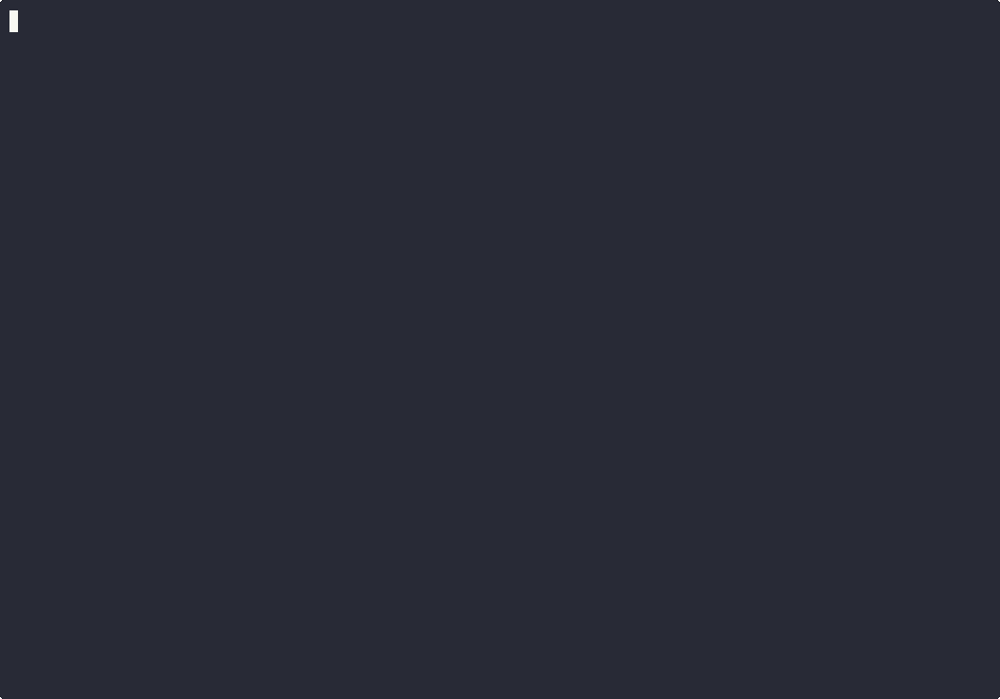

# aisw

<p align="center">
  <picture>
    <source media="(prefers-color-scheme: dark)" srcset="https://raw.githubusercontent.com/burakdede/aisw/main/website/public/aisw-mark-dark.svg">
    
  </picture>
</p>

<p align="center">Account manager and account switcher for Claude Code, Codex CLI, and Gemini CLI.</p>

<p align="center">
  <a href="https://crates.io/crates/aisw">
    
  </a>
  <a href="https://github.com/burakdede/aisw/actions/workflows/ci.yml">
    
  </a>
  <a href="https://github.com/burakdede/aisw/releases">
    
  </a>
  <a href="https://burakdede.github.io/aisw/">
    
  </a>
</p>

`aisw` stores named profiles under `~/.aisw/` and applies the selected profile to each tool's live config.

## Demo



## Install

```sh
# Homebrew
brew tap burakdede/tap
brew install aisw

# or shell installer (Linux/macOS)
curl -fsSL https://raw.githubusercontent.com/burakdede/aisw/main/install.sh | sh

# or Cargo
cargo install aisw
```

## Quickstart

```sh
# First-time setup
aisw init

# Add profiles
aisw add claude work --api-key "$ANTHROPIC_API_KEY"
aisw add codex personal --api-key "$OPENAI_API_KEY"

# Switch
aisw use claude work

# Inspect
aisw status
aisw list
```

## Command surface

```text
aisw add <tool> <profile> [--api-key KEY] [--from-env] [--label TEXT] [--set-active]
aisw use <tool> <profile> [--state-mode isolated|shared]
aisw use --all --profile <profile>
aisw list [tool] [--json]
aisw status [--json]
aisw remove <tool> <profile> [--yes] [--force]
aisw rename <tool> <old> <new>
aisw backup list [--json]
aisw backup restore <backup_id> [--yes]
aisw init [--yes]
aisw uninstall [--dry-run] [--remove-data] [--yes]
aisw shell-hook <bash|zsh|fish>
aisw doctor [--json]
```

## Supported tools

| Tool | Binary | Auth methods |
|---|---|---|
| Claude Code | `claude` | OAuth, API key |
| Codex CLI | `codex` | OAuth, API key |
| Gemini CLI | `gemini` | OAuth, API key |

## Docs

- [Quickstart](https://burakdede.github.io/aisw/quickstart/)
- [Commands](https://burakdede.github.io/aisw/commands/)
- [Automation](https://burakdede.github.io/aisw/automation/)
- [Troubleshooting](https://burakdede.github.io/aisw/troubleshooting/)

## License

MIT.
