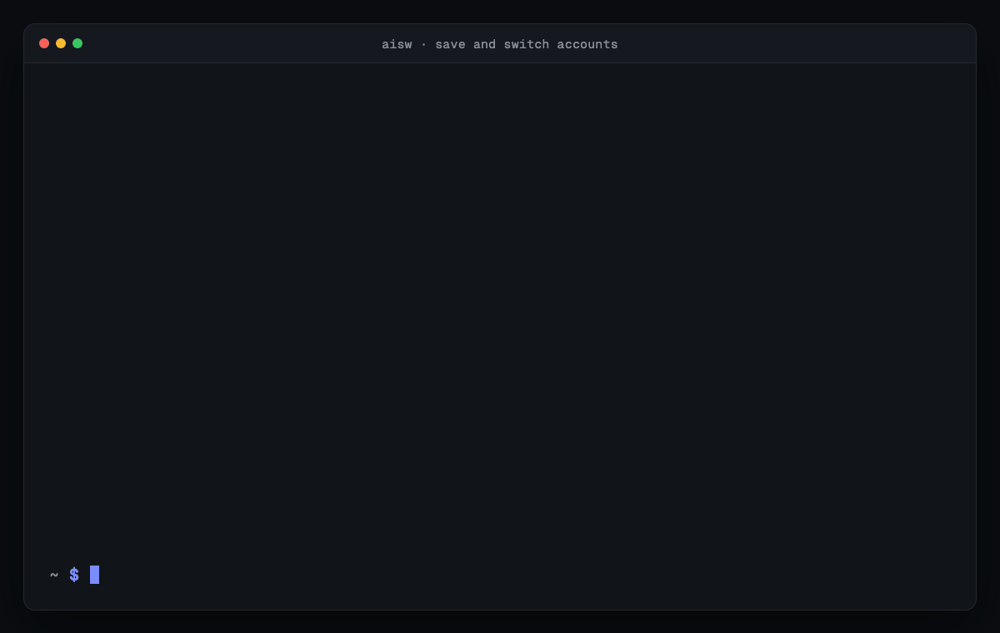
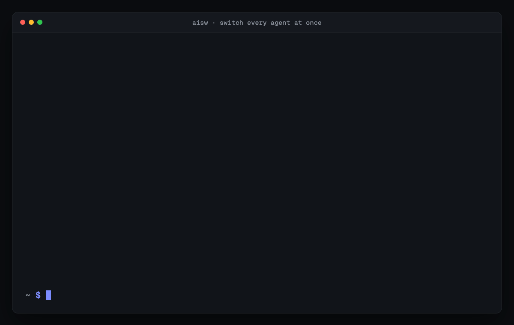

<p align="center">
  
</p>

<h1 align="center">aisw</h1>

<p align="center"><strong>Switch Claude Code, Codex CLI, Gemini CLI and Antigravity CLI accounts in one command.</strong></p>

<p align="center">
  <a href="https://crates.io/crates/aisw"></a>
  <a href="https://github.com/burakdede/aisw/actions/workflows/ci.yml"></a>
  <a href="https://github.com/burakdede/aisw/releases"></a>
  <a href="https://aiswitcher.dev/docs/"></a>
</p>

`aisw` (AI Switcher) saves each coding-agent login as a named profile and switches
between them without logging out, copying `auth.json` or editing hidden config. It
can switch all four agents together and refuse to start an agent in a repository
while the wrong account is active. It runs locally, with no account, telemetry or
proxy.

## The problem it solves

- **Two accounts, one machine.** A work and a personal Claude Code or Codex login
  overwrite each other, and switching means signing out and back in.
- **Every agent stores auth differently.** Claude Code uses the macOS Keychain or
  `.credentials.json`, Codex CLI uses `CODEX_HOME/auth.json`, Gemini CLI uses
  `~/.gemini`. Hand-copying these files breaks token refresh.
- **The wrong account in the wrong repository.** Nothing stops a personal login from
  running in a client repository.

## Features

### Save and switch accounts

Import the login you already have, add others by OAuth sign-in or API key, and
switch with a backup taken first. Each switch rolls back if any write fails.
[Adding profiles →](https://aiswitcher.dev/docs/adding-profiles/)



### Switch every agent at once

A context maps one profile per agent under a single name, even when the profile
names differ. `aisw context use` moves all of them together, or none.
[Profiles, contexts and workspace rules →](https://aiswitcher.dev/guides/workflows/profiles-vs-contexts/)



### Guard a repository

Bind a folder, repository or GitHub org to a context. With the shell hook, the
guard warns or refuses to launch `claude`, `codex`, `gemini` or `agy` on a
mismatch and prints the command that fixes it.
[Workspace guardrails →](https://aiswitcher.dev/docs/workspace/)


## Install

```sh
# Homebrew (macOS, Linux)
brew install burakdede/tap/aisw

# Shell installer (macOS, Linux)
curl -fsSL https://raw.githubusercontent.com/burakdede/aisw/main/install.sh | sh

# Cargo (any platform)
cargo install aisw
```

Windows binaries and checksums are on the [releases page](https://github.com/burakdede/aisw/releases).
[AI Switcher Desktop](https://aiswitcher.dev/desktop/) and the
[VS Code and Cursor extension](https://marketplace.visualstudio.com/items?itemName=aisw.aisw-vscode)
use the same profiles.

## Quick start

```sh
# Install the shell hook and import the logins you already have
aisw init

# Add accounts by OAuth sign-in or API key
aisw add claude work
aisw add codex work-api-key --api-key "$OPENAI_API_KEY"

# Switch one agent, or every agent in a context
aisw use claude work
aisw context create work --claude work --codex work-api-key
aisw context use work

# See what each agent is using now
aisw status
```

Start a new agent session after switching; a running process keeps the account it
started with. The [quickstart](https://aiswitcher.dev/docs/quickstart/) walks
through each step.

## Supported tools

| Tool | Binary | Auth | Platforms |
| --- | --- | --- | --- |
| Claude Code | `claude` | OAuth, API key | macOS, Linux, Windows |
| Codex CLI | `codex` | ChatGPT sign-in, API key | macOS, Linux, Windows |
| Gemini CLI | `gemini` | Enterprise Google sign-in, Vertex AI, API key | macOS, Linux, Windows |
| Antigravity CLI | `agy` | OAuth, API key | macOS, Linux, Windows |

Per-tool storage, state modes and limits are in
[Supported tools](https://aiswitcher.dev/docs/supported-tools/).

## How it works

- Profiles live under `~/.aisw/`, with secrets in the OS keyring (Keychain, Secret
  Service, Credential Manager) or `0600` files.
- A switch writes the credentials to where each agent already reads them, after a
  backup, as one transaction. [How it works →](https://aiswitcher.dev/docs/how-it-works/)
- Every command takes `--json` and uses stable exit codes, so `aisw verify` works as a
  CI gate. [Automation →](https://aiswitcher.dev/docs/automation/)
- Nothing leaves the machine. [Security →](https://aiswitcher.dev/docs/security/)

## Documentation

[Docs](https://aiswitcher.dev/docs/) ·
[Commands](https://aiswitcher.dev/docs/commands/) ·
[Guides](https://aiswitcher.dev/guides/) ·
[FAQ](https://aiswitcher.dev/docs/faq/) ·
[Troubleshooting](https://aiswitcher.dev/docs/troubleshooting/)

## Community projects

- [aipets](https://github.com/Kakoedlinnoeslovo/aipets): a macOS menu-bar widget (SwiftBar) that shows every aisw profile's Claude Code / Codex quota as a tamagotchi-style pet, with one-click switching and add/remove.

## License

MIT.
