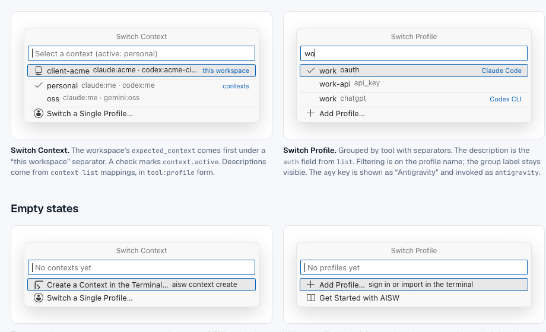
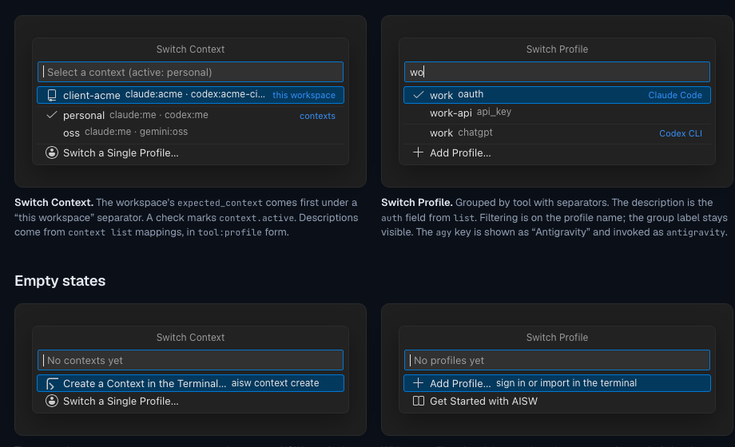
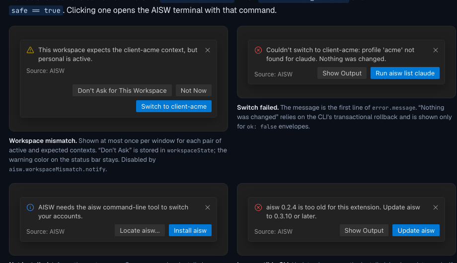

# [AI Switcher](https://aiswitcher.dev) for Coding Agents

Switch the account behind Claude Code, Codex CLI, Gemini CLI, and Antigravity
from VS Code or Cursor. Keep work, personal, and client profiles separate
without copying credential files or editing hidden configuration.

AI Switcher is a thin editor client for the local `aisw` CLI. Your profiles,
contexts, credentials, and provider-specific login flows remain owned by
`aisw` and the provider's native tools.

Learn more about [account switching](https://aiswitcher.dev/docs/why-aisw/)
and [workspace guardrails](https://aiswitcher.dev/docs/workspace/) at
[aiswitcher.dev](https://aiswitcher.dev/).

## Install and start switching

1. Install the [`aisw` CLI](https://aiswitcher.dev/docs/quickstart/).
2. Install this extension in VS Code or Cursor.
3. Open the Command Palette and run **AISW: Get Started**.
4. Import existing logins or add profiles in the visible AISW terminal.
5. Click the account in the status bar to switch profiles or contexts.

If `aisw` is missing, the extension detects it and offers the supported
installation or binary-location flow. No restart is required after a
successful install.

## See the active account at a glance

The status bar shows the context or profiles that are active in the current
editor window. Hover for the per-tool details. A workspace mismatch is called
out before you launch an agent, with a one-click option to switch to the
expected context.

## Common workflows

### Work and personal accounts

Keep separate accounts for work and personal repositories, then switch from
the status bar or Command Palette instead of manually logging out or editing
provider configuration. See the [work and personal account
workflow](https://aiswitcher.dev/docs/common-situations/).

### Client-specific coding contexts

A context groups the right Claude Code, Codex CLI, Gemini CLI, and Antigravity
profiles for one client or project. Profile names can differ between tools;
the context gives the workspace one clear name to activate. See
[common switching situations](https://aiswitcher.dev/docs/common-situations/).

### The right account for the right repository

Bind a repository or Git remote to an expected context. AI Switcher warns when
the active account does not match that workspace, reducing the risk of using
personal credentials in a client project. Read the [workspace guardrails
guide](https://aiswitcher.dev/docs/workspace/) for path, repository, and Git
remote bindings.

## Useful commands

Open the Command Palette and search for `AISW`:

See the complete [AISW command reference](https://aiswitcher.dev/docs/commands/)
for every command and setting.

- **AISW: Switch Context** — activate a multi-tool context.
- **AISW: Switch Profile** — activate one tool profile.
- **AISW: Switch to Workspace Context** — apply the context expected by this repository.
- **AISW: Verify Active Accounts** — check the active profiles and show remediation.
- **AISW: Add Profile** — start the native provider login or profile flow.
- **AISW: Import Existing Logins** — capture accounts already configured on this machine.
- **AISW: Show CLI Diagnostics** — inspect the detected binary and compatibility state.

All mutations run through the local CLI. The extension does not rewrite provider
credential files directly.

## Requirements

- VS Code 1.93 or later, or a compatible Cursor release.
- The `aisw` CLI installed on the same local machine as the editor.
- A fresh agent process after switching so it reads the newly active state.

See the [supported tools and platform matrix](https://aiswitcher.dev/supported-tools/)
for CLI-specific behavior.

Remote extension hosts, VS Code Web, Codespaces, and remote workspaces are not
supported in the current release.

## Privacy and security

Credentials never pass through the extension or a remote service. AI Switcher
communicates with the local `aisw` process using structured JSON. Profile
storage and provider authentication remain under `aisw` and the provider's
native credential stores. Read the [security model](https://aiswitcher.dev/security/)
for storage, keyring, and privacy details.

## Learn more and get help

- [Documentation](https://aiswitcher.dev/docs/)
- [Quickstart](https://aiswitcher.dev/docs/quickstart/)
- [Troubleshooting](https://aiswitcher.dev/docs/troubleshooting/)
- [Source code](https://github.com/burakdede/aisw)
- [Report an issue](https://github.com/burakdede/aisw/issues)
